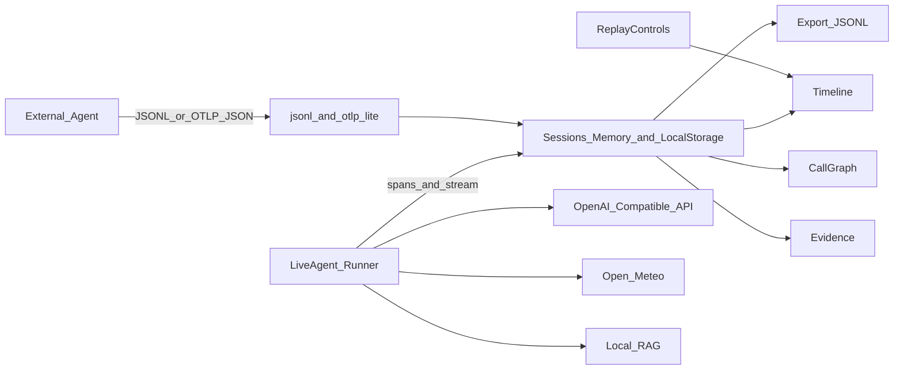

# Architecture

## 目标

薄后端：浏览器完成 Agent / RAG 观测闭环，方便演示与二次接入。

## 数据流

1. Live Run：`src/runner/liveAgent.ts` 边跑边写 span，答案走 SSE  
2. 导入导出：`parseJsonl` / `sessionToJsonl`  
3. 持久化：`src/storage/sessions.ts`（最多 20 条）  
4. 视图用 `selectedId` / `replayIndex` 联动  

## 模块

| 模块 | 职责 |
|---|---|
| `src/types.ts` | 协议类型 |
| `src/adapter/jsonl.ts` | 解析、导出、Diff |
| `src/adapter/otlp-lite.ts` | OTLP JSON 子集 → Session |
| `src/components/*` | 时间线、图、证据、回放 |
| `src/App.tsx` | 会话与导入 |

## 取舍

- MVP 不堆重后端，先把可视化做完整  
- JSONL 先跑通接入，再扩框架 SDK  
- 回放用 `endMs` 过滤未到达节点，不做复杂状态机  

## 扩展

- Ingest HTTP / 完整 OTLP  
- 万级 span 虚拟列表  
- LangGraph / Dify 等适配器  
